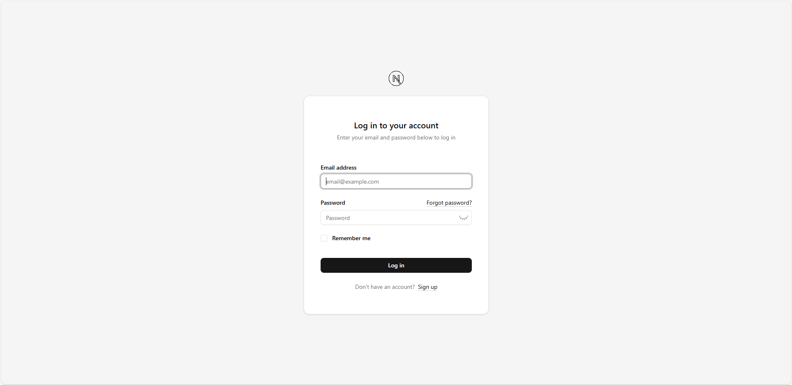
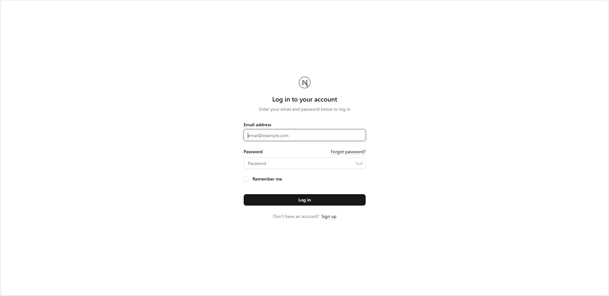
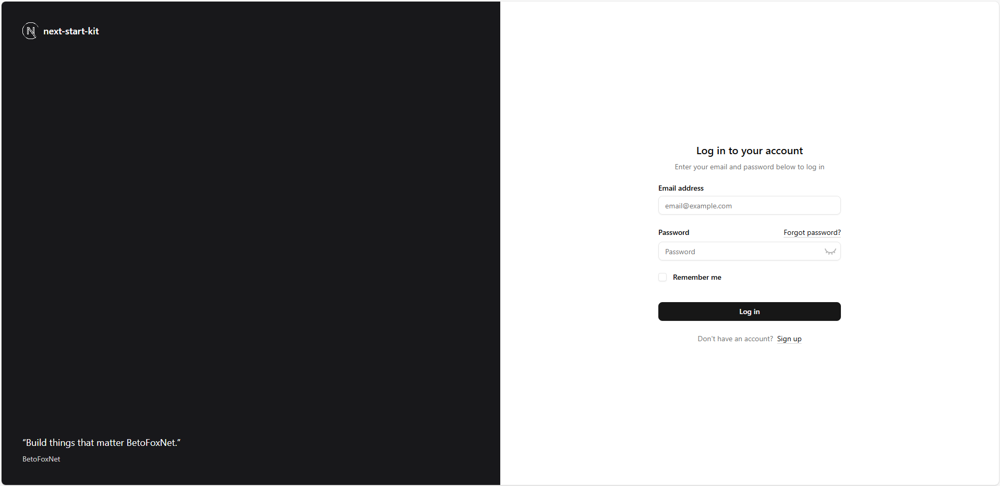
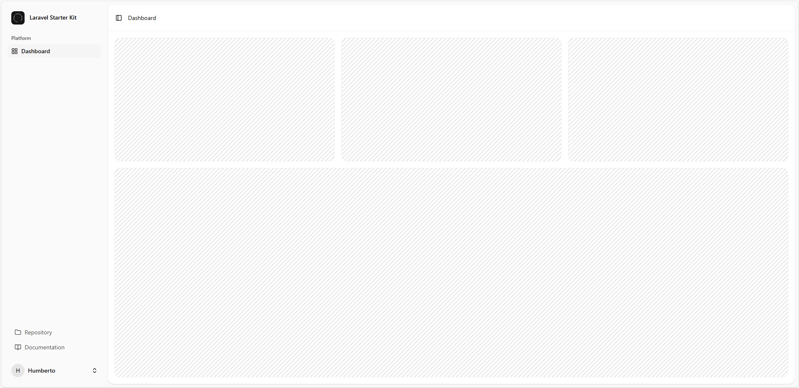
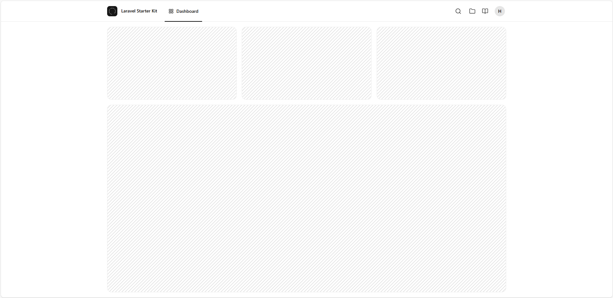
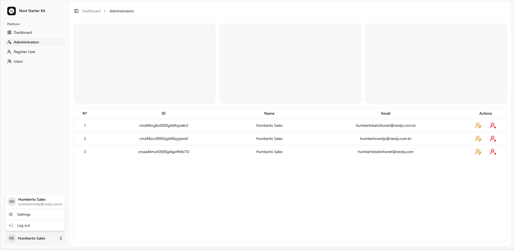
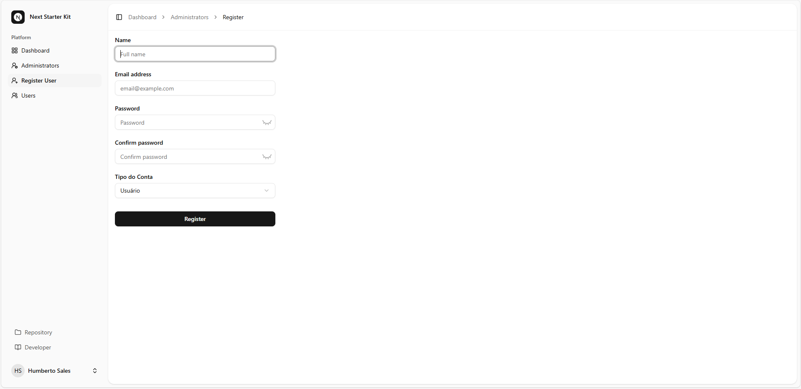
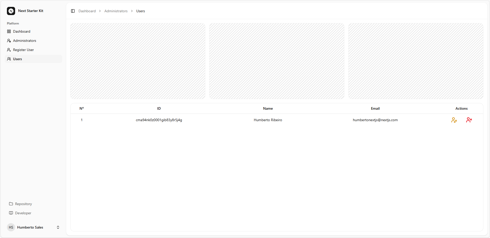
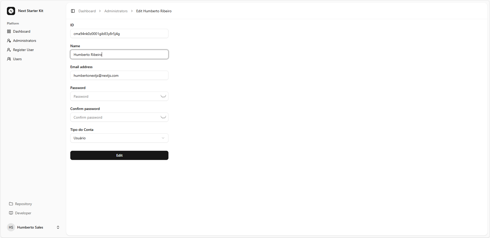

<div align="center">

  <a href="https://betofoxnet-info.vercel.app/"></a>

# BetoFoxNet


  <a href="https://nextjs.org/"></a>

## About NextJS
### Authentication!
## Auth.js

</div>

## 📝 User Registration

New user registration uses **Next.js 15 (App Router)**, **Shadcn/ui** visual layout, validation with **Zod**, persistence via **Prisma** and password hashing with **bcrypt-ts**. After registration, the user is automatically authenticated with `next-auth` or `auth` v5-beta.

---

### 📁 Files Involved

| Path                          | Description                                              |
|-------------------------------|----------------------------------------------------------|
| `app/register/page.tsx`       | Registration page that renders the component `Register`  |
| `app/api/actions/register.ts` | Server action that processes and stores the registration |
| `lib/zod.ts`                  | Form validation scheme with Zod                          |
| `lib/prisma.ts`               | Prisma Client instance for database persistence          |

---

### 🧩 Components and Features

#### 1. Registration Form
- Fields: `name`, `email`, `role`, `password`, `password_confirmation`
- Validation with Zod (client and server side)
- Auto-focus email on error
- Displaying success or error messages
- Automatic authentication after successful registration

---

#### 2. Server Action: `registerIn`
- Validates fields with `signUpSchema` (Zod)
- Check if the email is already registered
- Create new user with encrypted password
- Returns feedback messages to the client

---

### 🔁 Complete Registration Flow

1. User accesses `/register`
2. Form is filled and submitted
3. Data is sent to `registerIn` via server action
4. `registerIn`:
   - Validates with Zod
   - Check for duplicate e-mail
   - Create user (password hash included)
5. If successful:
   - Clear the form
   - Perform automatic login with `signIn`
6. In case of error:
   - Shows messages like: "Data already registered", "Something went wrong"

---

### ✅ Additional Resources

- **Password Confirmation**: Validation between `password` e `password_confirmation`
- **Show/Hide Password**: Implemented with `lucide-react` (`Eye`/`EyeClosed`)
- **Visual messages**: Dynamically styled based on success or failure
- **Button with loading state**: Uses `LoaderCircle` when `pending = true`

---

### 🔐 Security

- Password Hash with `bcrypt-ts` (12 rounds)
- Single email check before creating user
- No passwords stored in plain text

---

## 🔐 User Login

The login functionality of this app uses **Next.js 15 (App Router)**, **NextAuth.js**, authentication by credentials and reactive forms with `useActionState`.

---

### 📁 Files Involved

| path                         | Description                                     |
|------------------------------|-------------------------------------------------|
| `app/login/page.tsx`         | Login page with asynchronous loading            |
| `app/login/login-client.tsx` | Client-side component with form and state logic |
| `app/api/actions/login.ts`   | Server action that authenticates the user       |
| `auth.ts`                    | Central configuration of NextAuth.js            |

---

### 🧩 Components and Features

#### 1. Components and Features
- Fields: `email`, `password`, `remember me`
- Field validation with `zod`
- Feedback real-time error
- Post-login redirect to `/dashboard`

---

#### 2. Server Action: `loginIn`
- Receives and validates form data
- Authenticate with `signIn('credentials')`
- Returns error or success messages to the front-end

---

#### 3. Settings NextAuth (`auth.ts`)
- Authentication via `CredentialsProvider`
- Password verification with `bcrypt-ts`
- Sessions managed via JWT
- User role = 'ADMIN' or 'USER'
- Session time 5 min idle disconnects

```bach

    session: {
        strategy: 'jwt',
        maxAge: 5 * 60,
        updateAge: 0
    },

```

---

### 🔁 Full Login Flow

1. User accesses `/login`
2. Form is displayed and filled in
3. Sending calls to server action `loginIn`
4. Validation and authentication are done on the server
5. In case of success:
   - User is redirected to `/dashboard`
6. In case of error:
   - Error messages are displayed on the form

---

### ✅ Additional Resources

- **Remember me**: checkbox available (still without active persistence)
- **Show/hide password**: with icons (`lucide-react`)
- **Temporary messages**: success and visible errors in UI
- **Automatic redirection if user is already logged in**

---

### 🛡️ Security

- Authentication via JWT (`strategy: 'jwt'`)
- Passwords protected with `bcrypt-ts`
- Tokens expired removed from database automatically
- No automatic redirection by NextAuth, avoiding silent failures

---

## ⚙️ Account Settings

The User Settings section offers three main functionalities: **profile editing**, **password change** e **appearance customization**. Tall are protected by active session (`next-auth`) and follow modern standards with form validation, visual transitions and interactive feedback.

---

### 🧑‍💼 Update Profile

> **Page:** `/dashboard/settings/profile`  
> **Server Action:** `updateUser`

---

#### Features:
- Update of **name** e **email**
- Pending email verification with link resending
- Feedback "Saved" with animation
- Field validation via `Zod`
- Duplicate email blocking at the bank
- Immediate session update upon success

---

#### Security:
- Check if new email already exists before updating
- Validates mandatory fields
- Redirects to logout after sending verification link

---

### 🔐 Password Change

> **Page:** `/dashboard/settings/password`  
> **Server Action:** `updatePassword`

---

#### Features:
- Fields: `current_password`, `password`, `password_confirmation`
- Validation with `Zod`:
  - New password ≠ current password
  - Mandatory fields
- Feedback with smooth transition "Saved"
- Button to show/hide passwords (`lucide-react`)

---

#### Security:
- Validates the current password with `bcrypt.compare`
- Encrypt new password with `bcrypt.hash`
- Prevents changing if new password is the same as current one

---

### 🎨 Appearance

> **Page:** `/dashboard/settings/appearance`

---

#### Funcionalidades:
- Switching between themes: `Light`, `Dark` and `System`
- Uses `next-themes` and `lucide-react` for icon control
- Stylish button highlighted in active theme
- Automatic persistence via browser localStorage

---

### 🧱 Reusable Structure and Components

| Component                                | Description                                              |
|------------------------------------------|----------------------------------------------------------|
| `AppLayout`                              | Main application layout with breadcrumb                  |
| `SettingsLayout`                         | Specific layout for settings pages                       |
| `HeadingSmall`                           | Header with section title and description                |
| `Input`, `Label`, `Button`, `InputError` | Basic UI with integration for feedback and accessibility |
| `AppearanceToggleTab`                    | Interactive theme selection button                       |

---

### 🔁 Visual Feedback Flow

- All actions have immediate returns with:
  - Field-specific error messages
  - Success feedback with transition
  - Buttons with charging status (`pending`)

---

### 🔐 Session Requirements

Each of the features requires:
- User authenticated via `auth()` (server side)
- Active session (`useSession()` on the client)

---

### 🔄 How to switch between authentication layout templates

The file responsible for defining the authentication layout is:

> **Page:** `/components/layouts/auth-layout.tsx`

---

#### Features:
- Changing layout templates for authentication pages.
- Three templates available: `auth-card-layout`, `auth-simple-layout`, and `auth-split-layout`.
- `AuthLayout` component used to wrap layouts with `children`, `title`, and `description`.

---

### 📁 Available templates

| Template              | Description                                                                    |
|-----------------------|--------------------------------------------------------------------------------|
| `auth-card-layout`    | Card layout, ideal for forms and simple interactions.                          |
| `auth-simple-layout`  | Simple and straightforward layout, with a basic structure.                     |
| `auth-split-layout`   | Split layout, with one section for content and another for images or graphics. |

---

### 🔁 How to switch between templates

To change the layout template, simply replace the layout import in the file `auth-layout.tsx`.

---

#### Exchange examples:

- To use the card layout:

```tsx

import AuthLayoutTemplate from '@/components/layouts/auth/auth-card-layout';

```

<div align="center">

  

</div>

---

- To use the simple layout:

```tsx

import AuthLayoutTemplate from '@/components/layouts/auth/auth-simple-layout';

```

<div align="center">

  

</div>

---

- To use the split layout:

```tsx

import AuthLayoutTemplate from '@/components/layouts/auth/auth-split-layout';

```

<div align="center">

  

</div>

---

### ✅ Nothing else needs to be changed!

- The component will continue to function normally. The change only affects the appearance of the authentication page.

---

### 🔐 Requisitos

- Each of the templates requires:

Applying the layout with `children`, `title`, and `description` passing the correct properties to the selected layout.

---

### 🧭 Application Layout Templates

> **Page:** `/components/layouts/app-layout.tsx`

---

#### Features:
- Changing templates for the main application layout (`AppLayout`).
- Authentication support with `next-auth`: layout is only rendered if there is an active session.
- Templates receive `user` and `breadcrumbs` as props.
- Child components (`children`) are rendered within the selected layout.

---

### 📁 Available templates

| Template              | Description                                                             |
|-----------------------|-------------------------------------------------------------------------|
| `app-sidebar-layout`  | Layout with navigation sidebar — ideal for dashboards and complex apps. |
| `app-header-layout`   | Fixed header layout at the top — more compact and straightforward.      |

---

### 🔁 How to switch between templates

To change the application's main layout template, **simply replace the layout import** in the `app-layout.tsx` file.

---

#### Exchange examples:

- To use the sidebar layout:

```tsx

import AppLayoutTemplate from '@/components/layouts/app/app-sidebar-layout';

```

<div align="center">

  

</div>

---

- To use the header layout:

```tsx

import AppLayoutTemplate from '@/components/layouts/app/app-header-layout';

```

<div align="center">

  

</div>

---

### ✅ Nothing else needs to be changed

The structure remains the same. The `AppLayout` component renders the chosen layout based on the import, passing in `user`, `breadcrumbs`, and `children`.

---

### 🔐 Session Requirements

This layout relies on authentication:

- User authenticated via `next-auth`.

- Active session verified with `useSession()`.

- Layout does not render if `session?.user` is missing.

---

### 🔒 layout Administrator

<div align="center">

  

</div>

---

<div align="center">

  

</div>

---

<div align="center">

  

</div>

---

<div align="center">

  

</div>

---

## Install packages

Node version 20+

Postgres 16+

---

```bash

git clone -b preview-staging https://github.com/HumbertoFox/next-auth-start-kit.git

```

---


```bash

npm install -g npm@11.3.0

```

---

```bash

npm install

```

---

### Environment Variables

---

```bash

AUTH_TRUST_HOST=
DATABASE_URL=
AUTH_SECRET=
AUTH_URL=
SMTP_HOST=
SMTP_PORT=
SMTP_USER=
SMTP_PASS=
AUTH_TRUST_HOST="false" **development**
AUTH_TRUST_HOST="true" **production**

```

---

```bash

npx prisma migrate dev

```

---

Deploy Vercel Add!

```bash

  export const dynamic = 'force-dynamic';

```

On the admin and users pages to avoid checking in the Database on Deploy.

⚠️ **Attention:** After adding the Database remove it!

> **Page:** `src\app\dashboard\admins\page.tsx`

> **Page:** `src\app\dashboard\admins\users\page.tsx`

---

### Developed in:

---

<div>

  
  
  
  
  
  
  
  
  
  
  
  
</div>